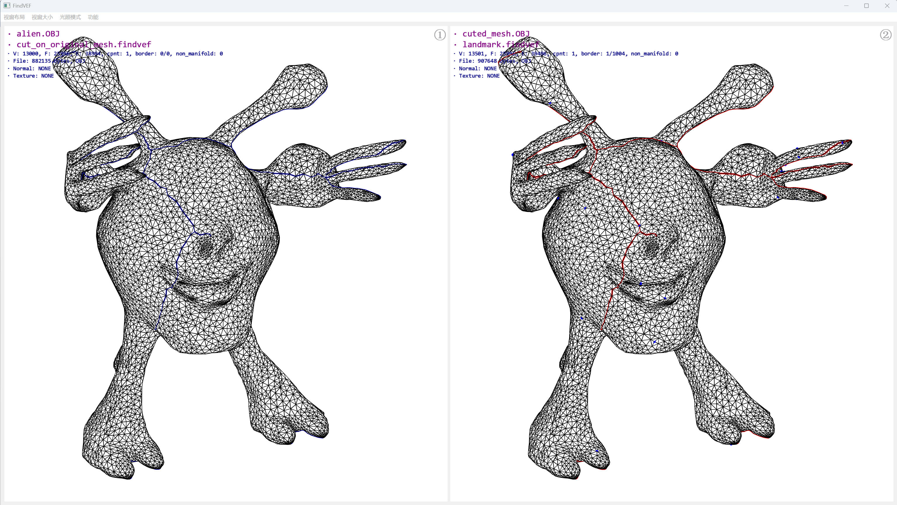

# FindVEF-Qt6

基于Qt6的3D网格可视化工具。
- 支持拖动`findvef`文件绘制所需要的点、线、面。
- 支持最多`2x4`屏同步对比。
- 支持`obj/fbx/off/glb/vtk`等格式的输入，并导出为`obj/off`格式



# 默认操作系统
Windows 11

# 如何配置
详见`script/cmake/paths.cmake`文件，你需要设置名为`OneDrive`的系统路径，并将所有第三方库放在`$ENV{OneDrive}/3rd-lib`下。所依赖的三方库也请参考`paths.cmake`文件。

# 如何编译
默认采用`msvc build tool 2022`编译。
```bash
mkdir build && cd build
cmake ..
```

# findvef文件格式
```txt
P
0 0.5 1
V
1
2
F
3
4
VE
1 2
PE
0 0.5 1 1 2 3
```
标签含义：
- P 绘制三维坐标
- V 绘制网格顶点idx
- F 绘制网格面idx
- VE 绘制顶点idx0, idx1之间的连线(不需要两者之间有边)
- PE 绘制两个三维坐标之间的连线

支持在绘制对象后指定颜色，例如绘制点`(0,0.5,1)`和`(1,2,3)`之间的一条灰色线段：
```
P
0 0.5 1 1 2 3 128 128 128
```

更多细节详见`src/utils/FindVEFHandler.h`